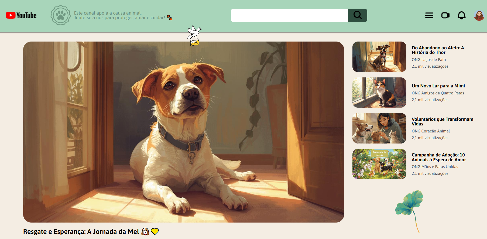
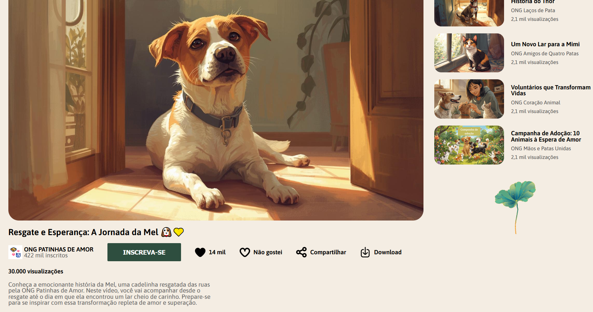

## 🐾 YouTube Pets

O **YouTube Pets** é um clone personalizado da página do **YouTube**, desenvolvido com **HTML e CSS puros**, criado no **bootcamp Santander 2025, em parceria com a DIO**. O projeto mantém a estrutura original do YouTube, mas adiciona uma **identidade visual voltada para causas animais**, com cores e elementos que incentivam a conscientização sobre adoção e proteção de animais.

 

## 🚀 Sobre o Projeto

Este projeto foi desenvolvido como parte do desafio prático do bootcamp:

* "Santander 2025 - Front-End"

O objetivo era **clonar a interface do YouTube utilizando Flexbox e CSS moderno**, aplicando conceitos de layout responsivo, organização semântica e criatividade. A página foi personalizada para **ONGs e conteúdos relacionados a causas animais**, incentivando engajamento e contribuição para a causa.

## 📚 Objetivos do Desafio

* Clonar a **interface do YouTube**;
* Praticar **Flexbox** e técnicas avançadas de layout em CSS;
* Adicionar **personalidade própria ao projeto**, com cores e elementos gráficos voltados para causas animais;
* Criar uma interface **acessível, organizada e visualmente agradável**;
* Explorar boas práticas de **HTML semântico e CSS puro**.

## 🛠️ Tecnologias Utilizadas

## 🖼️ Visualização do Projeto

Uma prévia das principais funcionalidades do **YouTube Pets**:

**🌐 Acesse o Projeto Online**

O projeto está disponível para visualização na **Vercel**. Clique no link abaixo para acessar:

**🎨 Identidade Visual e Interatividade**

Uso de cores diferenciadas, selo de ONG e elementos que incentivam engajamento.

**🌟 Sobre o conteúdo**

Trecho exibindo as informações do vídeo que está sendo acessado.

